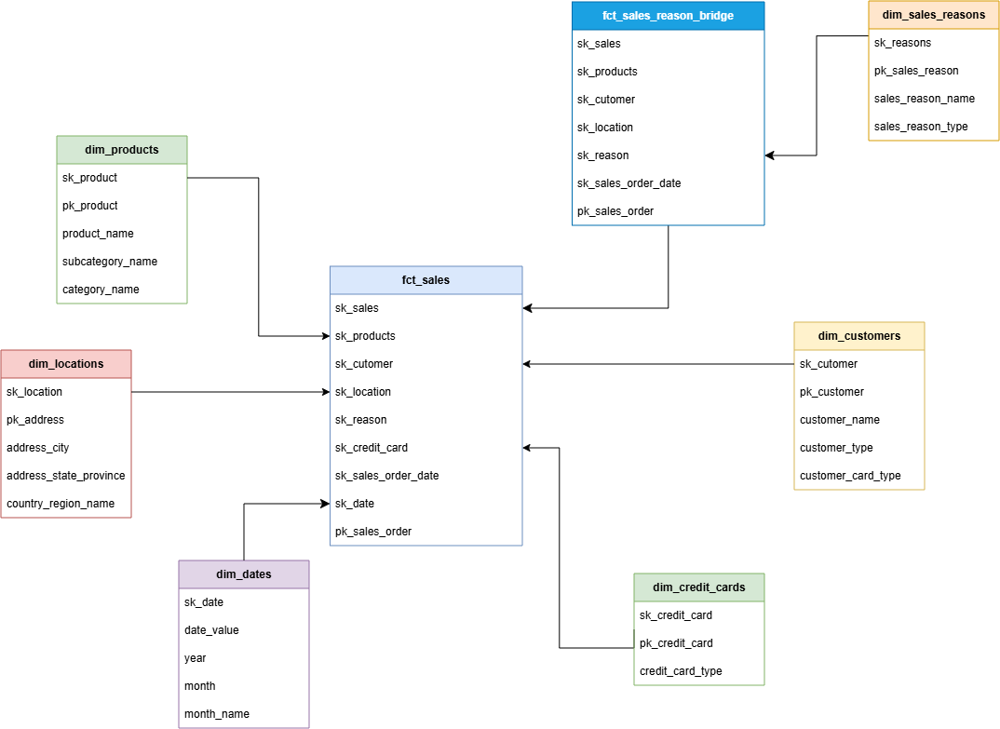

# 🚴 Adventure Works Analytics Platform

---

## 📌 Project Overview

A modern analytics platform designed to transform Adventure Works transactional sales data into reliable, documented, and analytics-ready data products.

Leveraging dbt and Databricks, the project implements a dimensional data warehouse tailored to answer critical business questions across sales performance, customer behavior, product trends, geography, payment methods, and purchasing drivers. The platform prioritizes high data quality, dimensional modeling, metric consistency, end-to-end lineage, governance, and seamless integration with BI tools.

---

## 🎯 Business Objectives & KPI Matrix (Questions a to f)

The solution was engineered and validated to answer six core strategic questions required by the executive sales leadership:

| ID | Business Goal / Question | Technical Resolution | Power BI Visual / Page |
| :---: | :--- | :--- | :--- |
| **a** | **Sales Performance Overview:** Total orders, quantity sold, gross revenue, net revenue, and average order value (AOV) broken down by region, customer, credit card, sales reason, date, and status. | Additive aggregations in `fct_sales` at the sales order line item grain (`SalesOrderDetail`). | Page 1: *Sales Overview* (KPI Cockpit & Filters) |
| **b** | **Regional & Temporal AOV:** Products with highest average order value distributed by period and geography. | DAX Measure `[AOV / Ticket Médio]` dividing net revenue by distinct order count. | Page 3: *Product & Sales Reason* |
| **c** | **Customer Ranking:** Top 10 customers by total accumulated revenue and location. | `TOP` ranking over unified B2C (Person) and B2B (Store) customer dimension (`dim_customers_en`). | Page 2: *Customer & Location* |
| **d** | **Urban Geographic Performance:** Top 5 cities with the highest accumulated revenue. | `Top 5` filter based on `[Net Revenue]` over `dim_locations_en`. | Page 2: *Customer & Location* |
| **e** | **Time Series & YoY Growth:** Monthly revenue evolution and Year-over-Year (YoY) comparison. | Time Intelligence DAX measures. | Page 1: *Sales Overview* |
| **f** | **Promotional Impact:** Top promotional product with highest quantity sold under the **"Promotion"** sales reason. | Bridge Table `fct_sales_reasons_bridge` isolating top product: **Mountain-100 Black, 44**. | Page 3: *Product & Sales Reason* |

---

## 🛠️ Technical Architecture & Modern Data Stack

```
[ Raw OLTP Source ] ──> [ Databricks Lakehouse ] ──> [ dbt Cloud (stg_ -> int_ -> marts_) ] ──> [ Power BI Dashboard ]
  Sales, Production,         Bronze / DW Layer            Star Schema (Fact & Dimensions)          3 Executive Pages
  Person, Purchasing
```

* **Data Warehouse / Storage:** Databricks (Delta Lake / Unity Catalog)
* **Data Transformation Engine:** dbt Cloud (Data Build Tool v1.8+)
* **Data Modeling:** Kimball Methodology (Dimensional Star Schema)
* **Quality & Governance:** Automated dbt Tests (`unique`, `not_null`, `relationships`, `dbt build`)
* **Data Visualization:** Power BI Desktop / Service (DAX Engine, 3 Interactive Pages)
* **Version Control & CI/CD:** Git / GitHub Actions

---

## 📐 Dimensional Modeling (Star Schema)

The main fact table is modeled at the atomic grain of **sales order line item (`SalesOrderDetail`)**, enabling additive aggregations without metric loss or double-counting.

```
                  ┌──────────────────────┐
                  │   dim_customers      │
                  └──────────┬───────────┘
                             │ (1:N)
┌──────────────────────┐     ▼      ┌──────────────────────┐
│   dim_products       ├───► ┌───┐ ◄───┤   dim_locations   │
└──────────────────────┘     │F  │  └──────────────────────┘
                             │C  │
┌──────────────────────┐     │T  │     ┌──────────────────────┐
│  dim_credit_cards    ├───► │_  │ ◄───┤     dim_dates        │
└──────────────────────┘     │S  │     └──────────────────────┘
                             │A  │
┌──────────────────────┐     │L  │     ┌──────────────────────────────┐
│ dim_sales_reasons    ├─┐   │E  │ ┌───┤ fct_sales_reasons_bridge     │
└──────────────────────┘ │   │S  │ │   └──────────────────────────────┘
                         └──►└───┘◄┘ (Relacionamento N:M Resolvido)
```

The analytical model was designed from the Adventure Works transactional schema by selecting the entities required to support the sales business questions.

At its core, `fct_sales` represents one sales order item and connects directly to dimensions for products, customers, dates, credit card and location. Sales reasons are associated separately through `bridge_sales_order_reason` to safely represent the many-to-many relationship at the sales order level.




### 🌉 Resolving Many-to-Many (N:M) Cardinality — Sales Reasons & Fan-Out Prevention
Sales orders can have multiple sales reasons assigned in `SalesOrderHeaderSalesReason`. A direct `JOIN` between sales orders and sales reasons would duplicate revenue lines (*Fan-Out effect*). To eliminate this risk:
1. Built intermediate table `int_sales_reasons_bridge_en.sql` mapping sales item surrogate keys to sales reason IDs.
2. Built bridge fact table `fct_sales_reasons_bridge.sql`.
3. Ensured global net revenue remains 100% accurate and uninflated regardless of reason filtering.

---

## 🏗️ dbt Transformation Layers

The project structure adheres to modular dbt best practices across three distinct layers:

```
models/
├── staging/                     # Data cleaning, type casting, snake_case_en standardization
│   ├── stg_sales__sales_order_header.sql
│   ├── stg_sales__sales_order_detail.sql
│   ├── stg_production_product.sql
│   └── ...
├── intermediate/                # Complex joins, B2C/B2B entity resolution, surrogate keys
│   ├── int_customer.sql      # Unification of Person.Person (B2C) and Sales.Store (B2B)
│   ├── int_location.sql      # Consolidation of Address + StateProvince + CountryRegion
│   ├── int_product.sql       # Product + Subcategory + Category + Fallback keys
│   └── int_sales_reasons_bridge.sql
└── marts/                       # Gold Production Layer: Star Schema for BI consumption
    ├── dim_customers.sql
    ├── dim_products.sql
    ├── dim_locations.sql
    ├── dim_credit_cards.sql
    ├── dim_sales_reasons.sql
    ├── dim_dates.sql
    ├── fct_sales.sql
    └── fct_sales_reasons_bridge.sql
```

---

## 🛡️ Data Quality, Testing & Governance

Automated data testing is embedded directly into the dbt pipeline using `schema.yml` assertions:

* **Primary Key Integrity:** `unique` and `not_null` tests on all Surrogate Keys generated via `dbt_utils.generate_surrogate_key` (MD5 hashes).
* **Referential Integrity:** `relationships` tests enforcing valid foreign key links between `fct_sales` and all dimension tables.
* **Fallback Keys:** Foreign key nulls are replaced with `-1` / `'Unassigned'` surrogate keys to prevent row loss during `INNER JOIN` operations.
* **Build Status:** 100% pass rate across all models verified via `dbt build`.

---

## 📊 Power BI Dashboard Architecture (3 Executive Pages)

### Page 1: Sales Overview (Executive Cockpit)
* **5 Core KPI Cards:** Gross Revenue, Total Discounts, Net Revenue, Total Orders, Units Sold.
* **Monthly Time Series Line Chart:** Revenue trends across years with Month-over-Month drill-down.
* **Channel Mix (Donut Chart):** Revenue distribution between Online B2C and Reseller B2B channels.

### Page 2: Customer & Location Intelligence
* **Geographic Heatmap:** Global sales density mapped across countries, states, and cities.
* **Top 10 Customers Bar Chart:** Accumulated revenue ranking with unified B2C and B2B names.
* **Top 5 Cities Table:** Highlighting top performing urban centers (Seattle, Sydney, London, etc.).

### Page 3: Product & Sales Reason Insights
* **Product Portfolio Analysis:** Revenue and unit sales sliced by Category and Subcategory.
* **Top 10 Products by AOV:** Identifying high-value order products.
* **Promotional Highlight Card:** Direct identification of the #1 product sold under 'Promotion': **`Mountain-100 Black, 44`**.

## 📐 DAX Key Measures Reference

```dax
// Net Revenue
NET_REVENUE = SUM( fct_sales[net_revenue] )

// Average Ticket
AVERAGE_TICKET = DIVIDE([NET_REVENUE],[TOTAL_ORDERS], 0)

// Average Ticket by Client
CLIENT_AVERAGE_TICKET = DIVIDE( [NET_REVENUE], [TOTAL_ACTIVE_CLIENTS], 0)

// Products Sold Quantity
PRODUCTS_SOLD_QUANTITY = SUM(fct_sales[sales_order_quantity] )

// Active Clients Total
TOTAL_ACTIVE_CLIENTS = DISTINCTCOUNT(fct_sales[sk_customer] )

// Top 1 City by Revenue
TOP_ONE_CITY_REVENUE = 
CALCULATE(
    SELECTEDVALUE( dim_location[address_city], "nO CITY" ),
    TOPN(
        1,
        VALUES( dim_location[address_city] ),
        [NET_REVENUE],
        DESC
    )
)

// Top 1 Product by Promotion
TOP_ONE_PRODUCT_PROMOTION = 
CALCULATE(
    SELECTEDVALUE( dim_products[product_name], "No Product" ),
    TOPN(
        1,
        ALL( dim_products[product_name] ),
        [PROMOTION_SALES_QUANTITY],
        DESC
    )
)
```

---

## 📁 Repository Structure

```
.
├── models/
│   ├── staging/
│   │
│   ├── intermediate/
│   │
│   └── marts/
│       ├── dimensions/
│       ├── bridge/
|       └── facts/
│
├── seeds/
├── tests/
├── macros/
├── docs/
|       ├── dashboard/
|       └── model/
├── dbt_project.yml
├── packages.yml
└── README.md

```

---

## 🚀 How to Reproduce & Run

1. **Clone the Repository:**
   ```bash
   git clone https://github.com/your-username/adventureworks-analytics-engineering.git
   cd adventureworks-analytics-engineering
   ```

2. **Configure dbt Profile (`profiles.yml`):**
   Set up your Databricks connection details (host, HTTP path, personal access token, schema).

3. **Install Dependencies & Execute Pipeline:**
   ```bash
   dbt deps
   dbt build
   ```

4. **Connect Power BI:**
   Open Power BI Desktop, connect to Databricks SQL Warehouse, select `marts` schema tables (`fct_sales`, `dim_*`), and refresh measures.

---

## Author

**Aline Satomi Noce**

Analytics Engineering • dbt • Databricks • SQL • Power BI

---

<p center="align">
  <i>Projeto desenvolvido para a Certificação de Analytics Engineering 2026 — AdventureWorks.</i>
</p>
